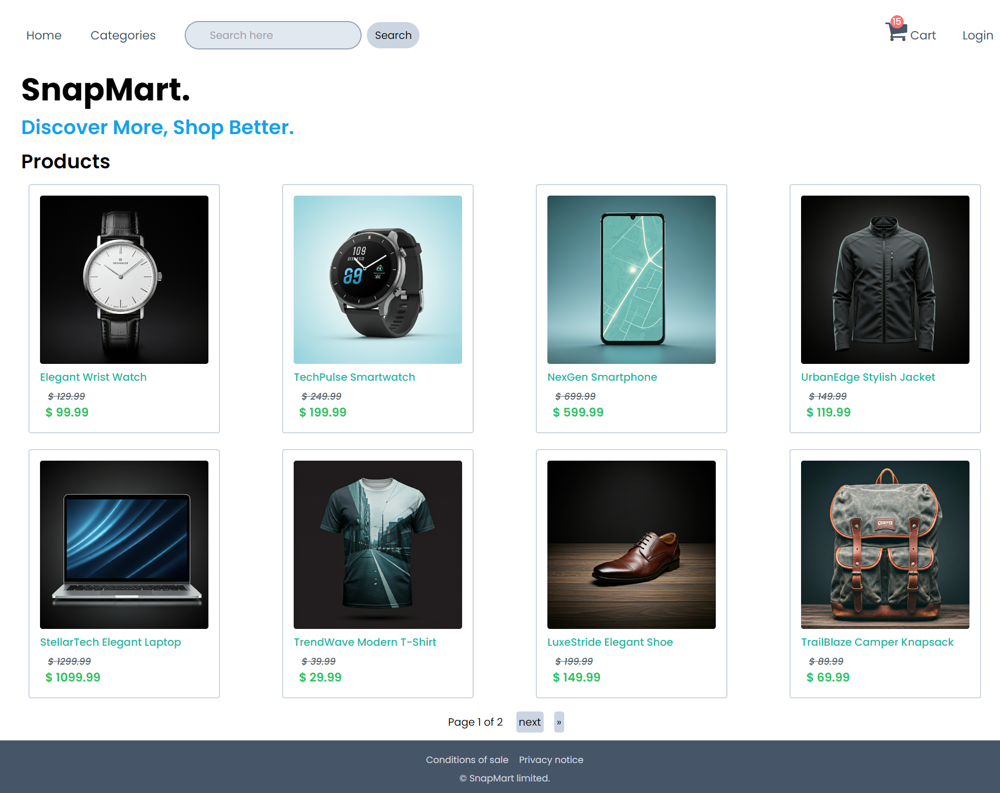
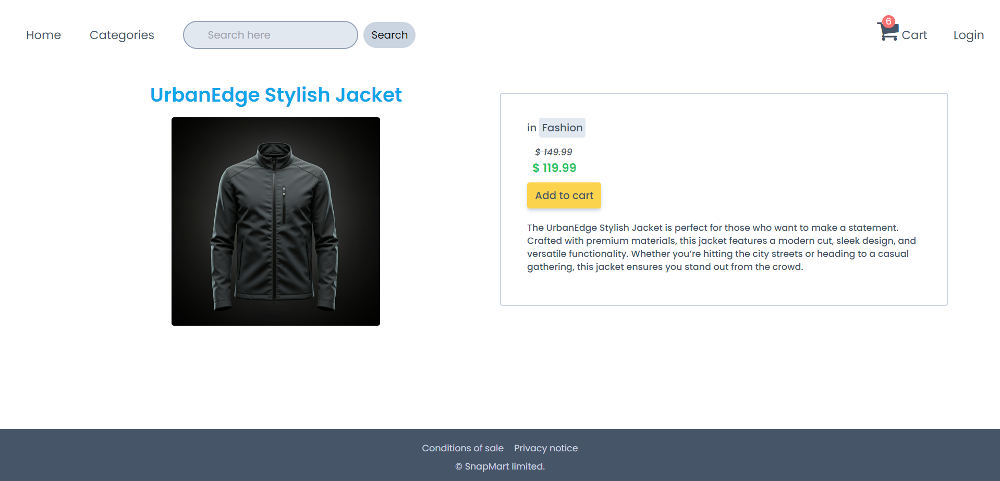
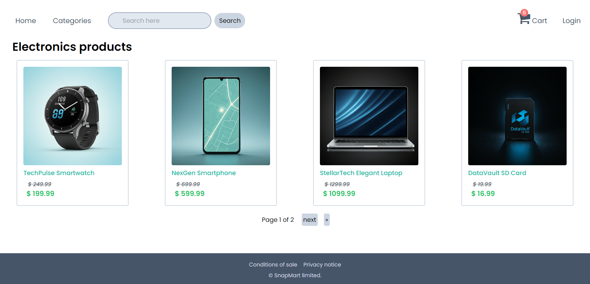
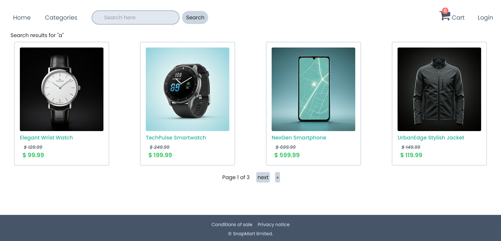
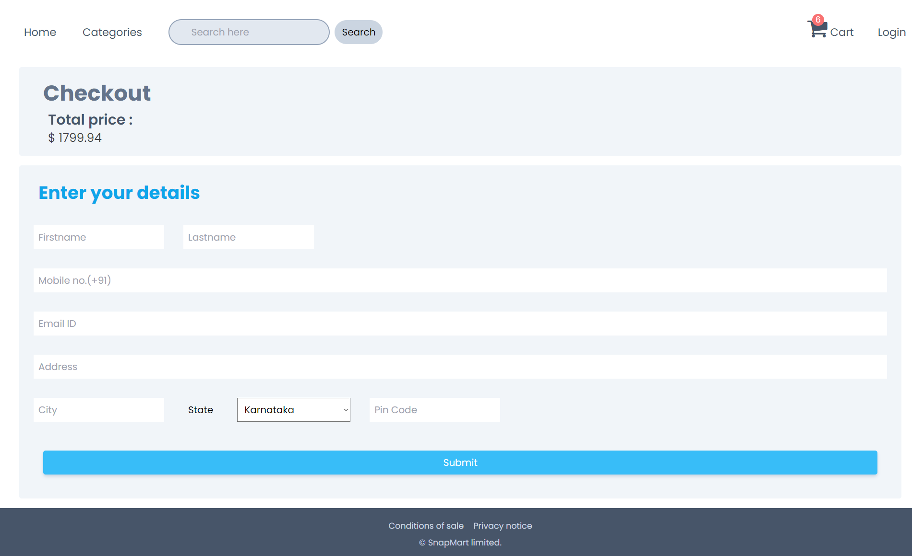
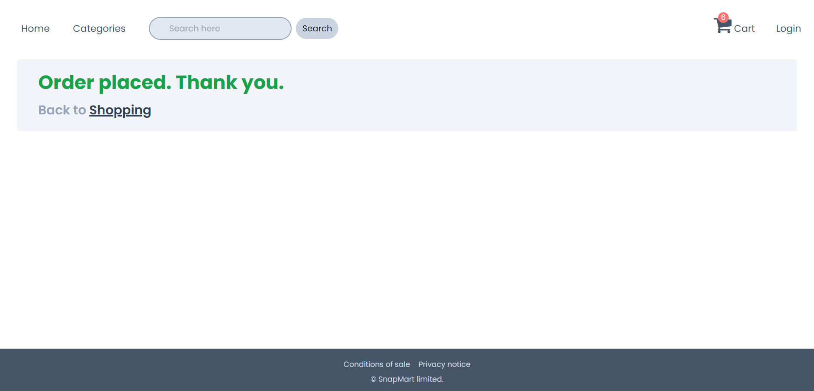

# E-commerce Web Application

## Overview
This project is e-commerce web application built using Django and JavaScript. Its actually the final one of the three e-commerce applications I built. Check out my github for other two.
It has complete features of professional e-commerce application like product listings, search functionality, detailed product views, and cart management. The application includes pagination for efficient handling of large datasets.

## Features
- **Home Page:** Displays all products with pagination.
- **Search Functionality:** Allows users to search for products by name with paginated results.
- **Product Details:** Provides a detailed view of each product.
- **Cart Management:** Handles the addition and removal of products in the shopping cart.
- **Category Management:** Displays products based on selected categories.
- **Order Generation:** Generates orders automatically based on checkout price and contents.

## Technologies Used
- **Backend:** Django, Python
- **Frontend:** HTML, CSS, JavaScript
- **Database:** SQLite (or specify the database used)
- **Tools:** Git, GitHub

## Installation
1. Clone the repository:
   ```sh
   git clone https://github.com/chriswilder3/snapmart.git
   ```
   
### Usage
- Access the home page to view all products.
- Use the search bar to find specific products.
- Click on a product to view its details.
- Add products to the cart and manage your selections.
- Look at total price calculated and decide on checkout
- Enter details of recipient on checkout page and confirm ordering.
- View and filter products by category.

### Project Structure
#### HTML Templates
- `base.html`: The master template containing the common layout for all pages.
- `index.html`: The home page template displaying all products.
- `searchresults.html`: The template for displaying search results.
  - Displays search results, includes pagination, and handles valid or invalid search terms.
- `detail.html`: The template for displaying detailed view of a product.
- `cartview.html`: The template for displaying the shopping cart.
  - Implements logic to dynamically manage cart items, including updating quantities and handling empty carts.
- `categories.html`: The template for displaying products by category.
  - Displays products in a specific category with pagination.
- `checkout.html`: The template for confirming price finally and entering user details (ex : Name, adrress, contact etc)
- `order.html`: The template for displaying order confirmation success

#### JavaScript
- JavaScript code for dynamically updating cart count and fetching categories is included in the HTML templates.

## Progress Screenshots
- 
- 
- 
- 
- 
- 
- 


